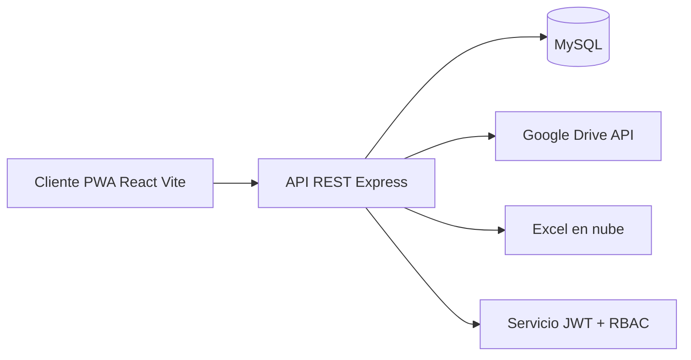
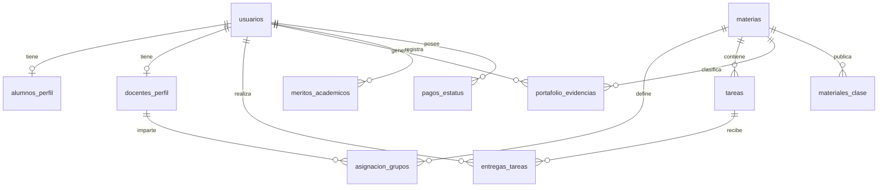

# DOCUMENTACION TECNICA UNIFICADA: ECOSISTEMA DIGITAL UNICEP

## 0. Metadatos del Documento
- Institucion: UNICEP Merida - Punto Evolutivo
- Tipo de documento: Especificacion tecnica de requisitos y arquitectura
- Formato: Markdown (texto plano limpio)
- Tecnologia base:
  - Frontend: React.js + Vite + PWA
  - Backend: Node.js + Express
  - ORM: Sequelize
  - Base de datos: MySQL
- Fecha: 2026-06-24
- Version: 1.0

---

## 1. Vision General del Proyecto

### 1.1 Objetivo
Construir un ecosistema educativo digital universitario con tres accesos independientes pero interconectados:
- Alumno
- Docente
- Administrativo (Control Escolar / Direccion)

La plataforma centraliza:
- Experiencia academica
- Comunicacion institucional
- Evidencias y portafolio
- Tareas y evaluaciones
- Calificaciones y kardex digital
- Seguimiento del plan de estudios
- Estatus financiero del alumno

### 1.2 Referencia funcional
Referencia base: EscoolKardex.

Enfoque de producto:
- Experiencia tipo Classroom + Kardex + Portafolio digital
- Interfaz moderna, intuitiva y escalable
- Arquitectura modular para crecimiento por fases

### 1.3 Alcance de la Fase 1
Incluye:
- Autenticacion y autorizacion por roles
- Dashboard por rol
- Tareas y entregas
- Materiales de clase
- Portafolio de evidencias
- Calificaciones y vista kardex
- Visualizacion de plan de estudios
- Consulta y validacion de pagos (sin pasarela de cobro)
- Panel administrativo para operaciones academicas y financieras
- Integracion con Google Drive y archivo Excel en la nube

No incluye en esta fase:
- Cobro en linea
- Motor de videoconferencia propio (solo enlaces/salas externas)
- Analitica avanzada con IA

---

## 2. Arquitectura de Solucion

### 2.1 Vista de alto nivel


### 2.2 Componentes principales
- Cliente web PWA:
  - UI responsiva para Android, iOS y Web
  - Service Worker para cache y acceso rapido
  - Manifest para instalacion en pantalla de inicio
- API Backend:
  - Endpoints REST modulares
  - Middleware de autenticacion JWT
  - Control de permisos por rol
  - Reglas de negocio academicas y financieras
- Persistencia:
  - MySQL para datos estructurados transaccionales
  - Google Drive para almacenamiento de archivos masivos
- Integraciones:
  - Sincronizacion de calificaciones desde Excel en nube

### 2.3 Principios arquitectonicos
- Modularidad por dominios funcionales
- Separacion de responsabilidades (UI, API, datos)
- Seguridad por defecto (autenticacion + autorizacion estricta)
- Escalabilidad horizontal del backend
- Trazabilidad de operaciones criticas

---

## 3. Modelo Relacional MySQL

### 3.1 Diagrama entidad relacion simplificado


### 3.2 Tablas y campos

#### Tabla: usuarios
- id_usuario (INT, PK, AUTO_INCREMENT)
- folio_matricula (VARCHAR(50), UNIQUE, obligatorio para acceso)
- nombre_completo (VARCHAR(150))
- correo (VARCHAR(100), UNIQUE)
- password_hash (VARCHAR(255))
- rol (ENUM('alumno', 'docente', 'administrativo'))
- foto_url (VARCHAR(255), NULL)
- fecha_creacion (TIMESTAMP)

#### Tabla: alumnos_perfil
- id_alumno (INT, PK, FK -> usuarios.id_usuario)
- carrera (VARCHAR(100))
- id_plan_estudio (INT, FK)
- bimestre_actual (INT)

#### Tabla: docentes_perfil
- id_docente (INT, PK, FK -> usuarios.id_usuario)
- estatus_laboral (ENUM('activo', 'inactivo'))

#### Tabla: materias
- id_materia (INT, PK, AUTO_INCREMENT)
- nombre_materia (VARCHAR(100))
- codigo_materia (VARCHAR(20))
- bimestre_pertenece (INT)

#### Tabla: asignacion_grupos
- id_asignacion (INT, PK, AUTO_INCREMENT)
- id_materia (INT, FK -> materias.id_materia)
- id_docente (INT, FK -> docentes_perfil.id_docente)
- grupo (VARCHAR(10))

#### Tabla: tareas
- id_tarea (INT, PK, AUTO_INCREMENT)
- id_materia (INT, FK -> materias.id_materia)
- titulo (VARCHAR(150))
- descripcion (TEXT)
- fecha_limite (DATETIME)
- archivo_adjunto_url (VARCHAR(255), NULL, enlace opcional a Google Drive)

#### Tabla: entregas_tareas
- id_entrega (INT, PK, AUTO_INCREMENT)
- id_tarea (INT, FK -> tareas.id_tarea)
- id_alumno (INT, FK -> alumnos_perfil.id_alumno)
- archivo_entrega_url (VARCHAR(255), almacenado en Google Drive)
- fecha_entrega (DATETIME)
- estatus (ENUM('pendiente', 'entregada', 'fuera_de_tiempo', 'calificada'))
- calificacion (DECIMAL(4,2), NULL)
- retroalimentacion (TEXT, NULL)

#### Tabla: portafolio_evidencias
- id_evidencia (INT, PK, AUTO_INCREMENT)
- id_alumno (INT, FK -> alumnos_perfil.id_alumno)
- id_materia (INT, FK -> materias.id_materia)
- periodo_bimestre (INT)
- archivo_url (VARCHAR(255), multiples registros hacia Google Drive)

#### Tabla: materiales_clase
- id_material (INT, PK, AUTO_INCREMENT)
- id_materia (INT, FK -> materias.id_materia)
- tema_semana (VARCHAR(100))
- tipo_archivo (ENUM('diapositivas', 'libro', 'resumen', 'pdf', 'enlace'))
- archivo_url (VARCHAR(255))

#### Tabla: meritos_academicos
- id_merito (INT, PK, AUTO_INCREMENT)
- id_alumno (INT, FK -> alumnos_perfil.id_alumno)
- tipo_merito (ENUM('diploma', 'constancia', 'reconocimiento', 'curso_adicional', 'taller'))
- nombre (VARCHAR(150))
- fecha (DATE)
- archivo_url (VARCHAR(255))

#### Tabla: pagos_estatus
- id_pago (INT, PK, AUTO_INCREMENT)
- id_alumno (INT, FK -> alumnos_perfil.id_alumno)
- concepto (VARCHAR(100))
- monto (DECIMAL(10,2))
- fecha_limite (DATE)
- estatus (ENUM('pagado', 'pendiente', 'vencido'))
- fecha_pago (DATE, NULL)
- folio_interno (VARCHAR(50), NULL)

### 3.3 Restricciones e indices recomendados
- Indices unicos:
  - usuarios.folio_matricula
  - usuarios.correo
- Indices de consulta:
  - tareas.id_materia
  - entregas_tareas.id_tarea, entregas_tareas.id_alumno
  - pagos_estatus.id_alumno, pagos_estatus.estatus, pagos_estatus.fecha_limite
- Integridad referencial con FK en cascada controlada:
  - ON UPDATE CASCADE
  - ON DELETE RESTRICT en entidades criticas

---

## 4. Modulos Funcionales por Rol

## 4.1 Acceso Alumno

### 4.1.1 Dashboard principal
Debe mostrar:
- Foto y datos del alumno
- Carrera
- Bimestre actual
- Horario de clases por bimestre
- Accesos rapidos a:
  - Anuncios
  - Tareas
  - Calificaciones
  - Material
  - Portafolio
  - Video clases (enlaces YouTube)

### 4.1.2 Zona de tareas
Por materia se muestra:
- Titulo
- Descripcion
- Fecha y hora limite
- Adjuntos opcionales
- Estado: Pendiente, Entregada, Fuera de tiempo, Calificada
- Calificacion y retroalimentacion del docente

### 4.1.3 Portafolio de evidencias
- Carga de multiples archivos por materia o bimestre
- Organizacion por materia y periodo
- Visibilidad para docente y control escolar
- Integracion con carpeta de Google Drive institucional

### 4.1.4 Material de clase
- Repositorio por materia
- Tipos: diapositivas, libros, resumenes, PDF, enlaces, videos
- Consulta y descarga segun permisos
- Organizacion por tema/semana

### 4.1.5 Meritos academicos
Portafolio curricular de:
- Diplomas
- Constancias
- Reconocimientos
- Cursos adicionales
- Talleres

Campos visibles por merito:
- Nombre
- Fecha
- Archivo adjunto (PDF o imagen)

### 4.1.6 Calificaciones y kardex digital
- Calificaciones por materia
- Calificacion final de bimestre
- Historial academico completo
- Estatus:
  - Aprobado
  - Reprobado
  - Extraordinario
  - Recursamiento
- Descarga directa del kardex

Nota de integracion:
- Calificaciones sincronizadas desde archivo Excel en nube

### 4.1.7 Plan de estudios
- Malla curricular por carrera
- Segmentacion de materias:
  - Cursadas
  - En curso
  - Pendientes
- Calculo dinamico de porcentaje de avance
- Visualizacion por bimestres

### 4.1.8 Pagos (consulta y validacion)
Sin cobro en linea en fase 1.

Submodulos:
- Resumen financiero:
  - Estado general (al corriente / adeudo)
  - Periodo activo
  - Total pagado vs adeudo pendiente
- Detalle de pagos:
  - Concepto
  - Monto
  - Fecha limite
  - Estatus (Pagado, Pendiente, Vencido)
  - Fecha de pago (si aplica)
  - Folio interno
- Carga de comprobantes para validacion administrativa

## 4.2 Maestros (Cuerpo Docente)
Usuarios operativos enfocados en la ejecucion del proceso de ensenanza-aprendizaje dentro de sus asignaturas correspondientes.

Funciones clave:
- Aula Virtual (estilo Google Classroom):
  - Creacion, asignacion y recepcion de tareas
  - Carga de materiales didacticos
  - Retroalimentacion a alumnos
- Clases en vivo:
  - Generacion y programacion de enlaces de videoconferencia en la plataforma
- Evaluacion y registro:
  - Captura de calificaciones dentro de los tiempos reglamentarios
  - Control diario de asistencia o aprovechamiento escolar
- Notificaciones:
  - Acceso a la seccion de anuncios
  - Recepcion de justificantes medicos/personales preaprobados por la institucion

## 4.3 Area Administrativa (Control Escolar / Direccion)
### 4.3.1 Director (Superusuario / Nivel Ejecutivo)
Responsable de supervision institucional, toma de decisiones criticas y autorizaciones excepcionales.

Funciones clave:
- Supervision ejecutiva:
  - Vista global de operacion academica y financiera
  - Seguimiento de indicadores y reportes institucionales
- Control de folios:
  - Definicion y supervision de politica de folios por rol
  - Asignacion y ajuste manual de folios de usuario y pagos
- Override financiero:
  - Autorizacion de cambios excepcionales de estatus financiero
  - Registro obligatorio de motivo y traza de auditoria
- Autorizaciones academicas especiales:
  - Aprobacion de calificaciones extemporaneas en casos justificados
  - Validacion de ajustes criticos fuera de ventana reglamentaria
- Infraestructura academica:
  - Asignacion o reasignacion de aula en horarios institucionales

### 4.3.2 Control Escolar
Equipo operativo-administrativo enfocado en la ejecucion diaria de procesos academicos, escolares y de ventanilla.

Funciones clave:
- Operacion escolar:
  - Gestion de alumnos, grupos y trazabilidad de estatus academico
  - Validacion operativa de entregas, evidencias y procesos escolares
- Gestion administrativa:
  - Alta y actualizacion de usuarios conforme a politicas institucionales
  - Administracion de materias, planes de estudio y periodos academicos
- Atencion de tramites:
  - Recepcion, seguimiento y resolucion de solicitudes de alumnos
  - Registro de respuestas y evidencias de resolucion
- Control financiero operativo:
  - Validacion de comprobantes de pago
  - Aplicacion de reglas de desbloqueo segun lineamientos
- Comunicacion institucional:
  - Coordinacion de avisos operativos con docentes y alumnos
  - Escalamiento de casos excepcionales a Direccion

### 4.3.3 Coordinacion Academica
Area enfocada en planeacion curricular, seguimiento docente y calidad academica transversal.

Funciones clave:
- Planeacion academica:
  - Seguimiento a carga academica, grupos y horarios
  - Coordinacion de asignaciones docente-materia
- Calidad y seguimiento:
  - Monitoreo de avance curricular por periodo
  - Acompanamiento de cumplimiento academico docente
- Articulacion institucional:
  - Vinculacion operativa entre Direccion, Control Escolar y Cuerpo Docente

---

## 5. Logica de Negocio Critica (Seccion 4.3)

### 5.1 Gestion administrativa de pagos
El area administrativa puede:
- Crear conceptos de pago personalizados
- Asignar montos por carrera o alumno
- Marcar pagos como realizados tras validacion
- Definir reglas automaticas de bloqueo/desbloqueo
- Autorizar desbloqueos manuales excepcionales
- Generar reportes de saldos

### 5.2 Flujo de bloqueo academico automatico
Regla principal:
- Si un pago supera fecha_limite sin validacion, cambia a estatus `vencido`
- Al detectar `vencido`, el sistema restringe inmediatamente servicios academicos del alumno

Servicios potencialmente restringidos:
- Acceso a clases
- Acceso a calificaciones (kardex)
- Acceso a materiales de estudio (segun politicas internas)

Regla de desbloqueo:
- Cuando administracion valida pago cubierto, se restablece acceso automaticamente
- Debe existir bitacora de evento para auditoria

### 5.3 Pseudoflujo de evaluacion de acceso
```text
SI existe pago_estatus = vencido PARA id_alumno
  ENTONCES estado_cuenta = bloqueado
  Y permisos_academicos = restringidos
SINO
  estado_cuenta = activo
  permisos_academicos = habilitados
FIN
```

---

## 6. Seguridad, Roles y Permisos

### 6.1 Autenticacion
- Inicio de sesion con correo/folio + password
- Password hasheado con algoritmo seguro (ej. bcrypt)
- Sesion con JWT firmado

### 6.2 Autorizacion RBAC
Control de acceso por rol en cada endpoint:
- alumno
- docente
- administrativo

Cada solicitud protegida valida:
- Token valido y vigente
- Rol del token contra datos en MySQL
- Regla de negocio (ej. bloqueo financiero)

### 6.3 Requisitos de seguridad adicionales
- Politica de expiracion y renovacion de tokens
- Rate limiting en endpoints de autenticacion
- Validacion de archivos (tipo, tamano, antivirus opcional)
- Logs de auditoria para cambios criticos
- CORS restringido por origen confiable

### 6.4 Filtrado por contexto (scope data)
- Toda consulta de maestros y alumnos debe condicionarse obligatoriamente al usuario autenticado.
- El backend debe obtener el identificador desde el token/sesion (`session.user_id` o equivalente), nunca desde un valor enviado por el cliente.
- Las consultas de maestros deben aplicar el alcance del docente, por ejemplo `WHERE docente_id = session.user_id`, y validar tambien la pertenencia de la materia, grupo o entrega.
- Las consultas de alumnos deben aplicar el alcance individual, por ejemplo `WHERE alumno_id = session.user_id`, para tareas, entregas, calificaciones, pagos, tramites, plan y evidencias.
- Un usuario no puede consultar, modificar ni inferir registros de otro usuario del mismo rol cambiando parametros, IDs o rutas.
- Las pruebas de autorizacion deben cubrir al menos dos usuarios distintos del mismo rol y comprobar respuestas `403` o resultados vacios segun la politica del endpoint.

### 6.5 Segregacion financiera para Soporte TI
- Soporte TI puede acceder a bases de datos, respaldos y herramientas de mantenimiento tecnico bajo auditoria.
- Las interfaces graficas de transacciones economicas deben permanecer bloqueadas para `soporte_ti`.
- El bloqueo aplica a pagos, becas, condonaciones, cambios de estatus financiero, desbloqueos manuales y cualquier operacion que modifique saldos o referencias.
- El backend debe rechazar tambien estas operaciones aunque el usuario intente invocarlas directamente, incluso si tiene acceso tecnico a infraestructura.
- Todo acceso de mantenimiento de Soporte TI debe registrar actor, modulo, accion, entidad, fecha, IP y resultado en `auditoria_eventos`.

### 6.6 Control temporal de calificaciones y excepciones
- El maestro conserva permiso de modificacion (`U`) sobre calificaciones unicamente dentro del periodo ordinario de evaluacion.
- El backend debe comprobar el periodo academico y la ventana de evaluacion en cada alta o modificacion; no debe confiar en que la interfaz oculte el boton.
- Una vez cerrado el periodo ordinario, toda modificacion debe rechazarse por defecto.
- La edicion extemporanea requiere una autorizacion vigente otorgada exclusivamente por el Director, asociada al docente, materia, alumno o entrega, periodo, motivo y fecha de expiracion.
- La autorizacion debe utilizar un token o estado de excepcion no reutilizable y quedar registrada en `auditoria_eventos`.
- El maestro debe presentar la autorizacion al registrar el cambio; el backend debe validar su vigencia, alcance y que no haya sido revocada.
- Cada cambio extemporaneo debe conservar valor anterior, valor nuevo, actor, autorizador, motivo, timestamp e identificadores de la entidad afectada.

---

## 7. Integraciones Externas

### 7.1 Google Drive API
Uso previsto:
- Almacenamiento de tareas, entregas, evidencias, meritos y materiales
- Gestion de enlaces por recurso
- Carpetas por materia, alumno y periodo

Consideraciones:
- Cuenta institucional de servicio
- Control de permisos de lectura/escritura
- Trazabilidad de archivos por id externo

### 7.2 Excel en la nube
Uso previsto:
- Fuente de sincronizacion de calificaciones oficiales

Requisitos:
- Proceso ETL validado
- Mapeo por folio_matricula e id_materia
- Versionado y control de conflictos
- Registro de importaciones (fecha, usuario, resultado)

---

## 8. API REST (Especificacion Base)

### 8.1 Convenciones
- Prefijo: `/api/v1`
- Formato: JSON
- Autenticacion: `Authorization: Bearer <token>`

### 8.2 Modulos de endpoints sugeridos
- Auth:
  - `POST /auth/login`
  - `POST /auth/refresh`
  - `POST /auth/logout`
- Usuarios y perfiles:
  - `GET /usuarios/me`
  - `PATCH /usuarios/me`
- Alumnos:
  - `GET /alumnos/dashboard`
  - `GET /alumnos/plan-estudio`
  - `GET /alumnos/calificaciones`
- Tareas:
  - `GET /materias/:id/tareas`
  - `POST /tareas/:id/entregas`
  - `GET /tareas/:id/mi-entrega`
- Materiales:
  - `GET /materias/:id/materiales`
- Evidencias:
  - `GET /evidencias`
  - `POST /evidencias`
- Meritos:
  - `GET /meritos`
  - `POST /meritos`
- Pagos:
  - `GET /pagos/mi-estatus`
  - `POST /pagos/comprobantes`
- Docentes:
  - `GET /docentes/grupos`
  - `POST /materias/:id/tareas`
  - `PATCH /entregas/:id/calificar`
- Administracion:
  - `POST /admin/usuarios`
  - `PATCH /admin/usuarios/:id`
  - `POST /admin/calificaciones/importar-excel`
  - `PATCH /admin/pagos/:id/validar`

---

## 9. Frontend PWA (React + Vite)

### 9.1 Requisitos funcionales
- SPA con rutas protegidas por rol
- Dashboard diferenciado por tipo de usuario
- Carga optimizada para moviles
- Notificaciones in-app para tareas, vencimientos y avisos

### 9.2 Requisitos PWA
- `manifest.json` con nombre, iconos, color y modo standalone
- Service Worker para:
  - Cache de assets estaticos
  - Estrategia de red para recursos API (controlada)
- Instalacion como acceso directo en Android/iOS/Web

### 9.3 Requisitos UX
- Navegacion simple y consistente
- Jerarquia visual clara por modulo
- Componentes reutilizables
- Estados de carga, vacio y error en todas las vistas

---

## 10. Requisitos No Funcionales

- Rendimiento:
  - Tiempo objetivo de carga inicial menor o igual a 3 segundos en red estable
- Disponibilidad:
  - Arquitectura preparada para respaldos y recuperacion
- Escalabilidad:
  - Separacion por modulos y posibilidad de servicios independientes
- Mantenibilidad:
  - Codigo tipado/documentado y convenciones de desarrollo
- Auditoria:
  - Registro de eventos criticos academicos y financieros
- Compatibilidad:
  - Navegadores modernos y resoluciones moviles/escritorio

---

## 11. Estrategia de Implementacion por Fases

### Fase 1 (MVP institucional)
- Autenticacion y roles
- Dashboard alumno/docente/admin
- Tareas y entregas
- Materiales
- Pagos consulta + validacion

### Fase 2
- Portafolio de evidencias completo
- Meritos academicos
- Kardex ampliado y exportaciones
- Reportes administrativos base

### Fase 3
- Automatizaciones avanzadas
- Indicadores institucionales
- Integraciones ampliadas
- Optimizaciones de escalabilidad

---

## 12. Criterios de Aceptacion Globales

- El sistema autentica usuarios por rol correctamente
- Cada rol solo accede a sus modulos autorizados
- Tareas y calificaciones operan de extremo a extremo
- Sincronizacion de calificaciones desde Excel es trazable
- Integracion de archivos con Google Drive funciona por modulo
- Regla de bloqueo por pagos vencidos se aplica automaticamente
- Desbloqueo posterior a validacion administrativa se refleja sin inconsistencias
- La PWA puede instalarse y operar en entorno movil

---

## 13. Riesgos y Mitigaciones

- Riesgo: Inconsistencia entre Excel y base de datos
  - Mitigacion: versionado de importaciones, validaciones previas y bitacora
- Riesgo: Errores de permisos en Drive
  - Mitigacion: cuenta de servicio institucional y pruebas por rol
- Riesgo: Bloqueos financieros aplicados indebidamente
  - Mitigacion: regla auditada, excepciones manuales y trazabilidad completa
- Riesgo: Sobrecarga de archivos
  - Mitigacion: limites de tamano/tipo y politicas de retencion

---

## 14. Anexo Tecnico (Recomendaciones de Implementacion)

- Estructura backend sugerida por dominios:
  - `auth`
  - `usuarios`
  - `alumnos`
  - `docentes`
  - `administracion`
  - `tareas`
  - `materiales`
  - `evidencias`
  - `calificaciones`
  - `pagos`
- Uso de migraciones Sequelize para versionamiento de esquema
- Semillas iniciales para roles y usuarios administrativos
- Entornos separados: desarrollo, pruebas, produccion
- CI/CD con pruebas minimas API y frontend

---

## 15. Estado del Documento
Documento base aprobado para iniciar:
- Diseno de base de datos
- Desarrollo de API
- Construccion de frontend PWA
- Planeacion de integraciones externas
